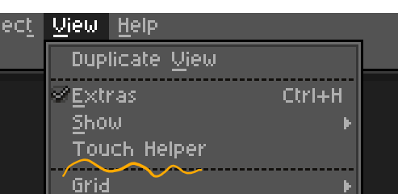

# Aseprite Touch Helper Dialog


Asepriteをタブレットとスタイラスペンで使うときに使える追加ツールバーです

参考：https://community.aseprite.org/t/touch-toolbar-helper/2169

# インストール

## 手動
`make`すると`./build/touch-helper-dialog.aseprite-extension`ができるあがるので、Asepriteの設定画面からインストールします

```zsh
$ git clone https://github.com/xztaityozx/aseprite-touch-helper-dialog
$ cd aseprite-touch-helper-dialog
$ make
```

## Download from GitHub Release
Download pre-build archive file from [GitHub Release](https://github.com/xztaityozx/aseprite-touch-helper-dialog/releases)

# アンインストール
Asepriteの設定画面から`Touch Helper Dialog`を削除します

# Usage
## **Open Touch Helper Dialog**


# Button Feature
- `Undo`/`Redo`
- `[+]/[-]`: Zoom In/Out
- Change tool
  - `B`: Pencil
  - `E`: Eraser
  - `I`: Eyedropper
  - `V`: Move
  - `H`: Hand
  - `L`: Line
  - `S+L`: Curve
  - `G`: Bucket
- Selection tool
  - `Rect`: Rectangular Marquee
  - `Wand`: Magic Wand
  - `Copy`/`Paste`

# LICENSE
[MIT LICENSE](./LICENSE)
